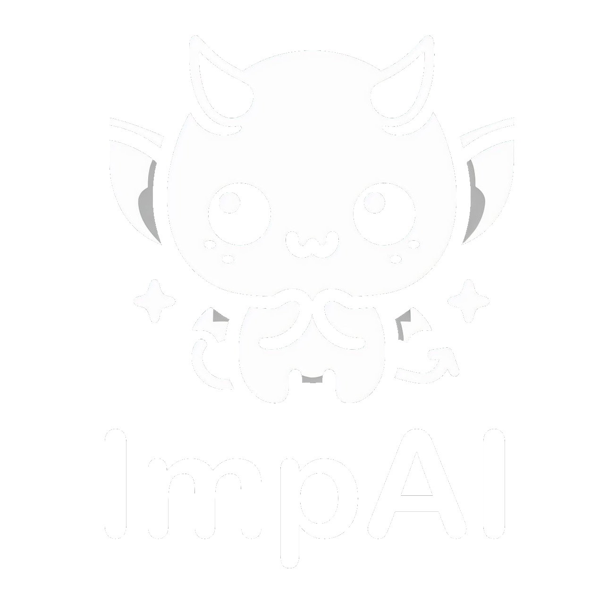
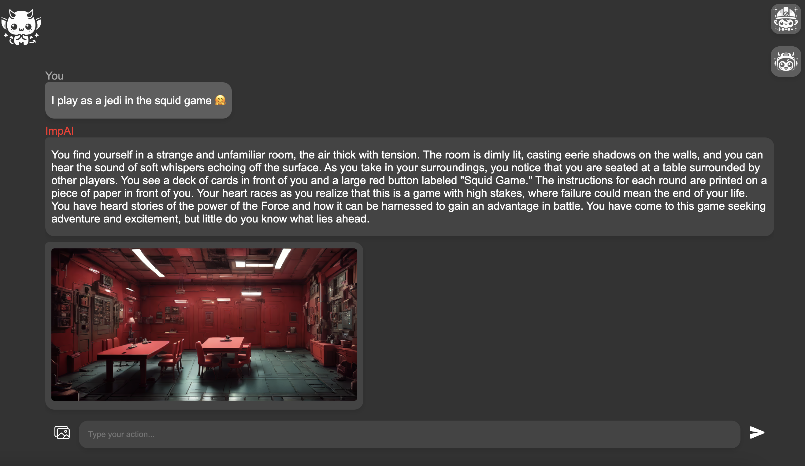
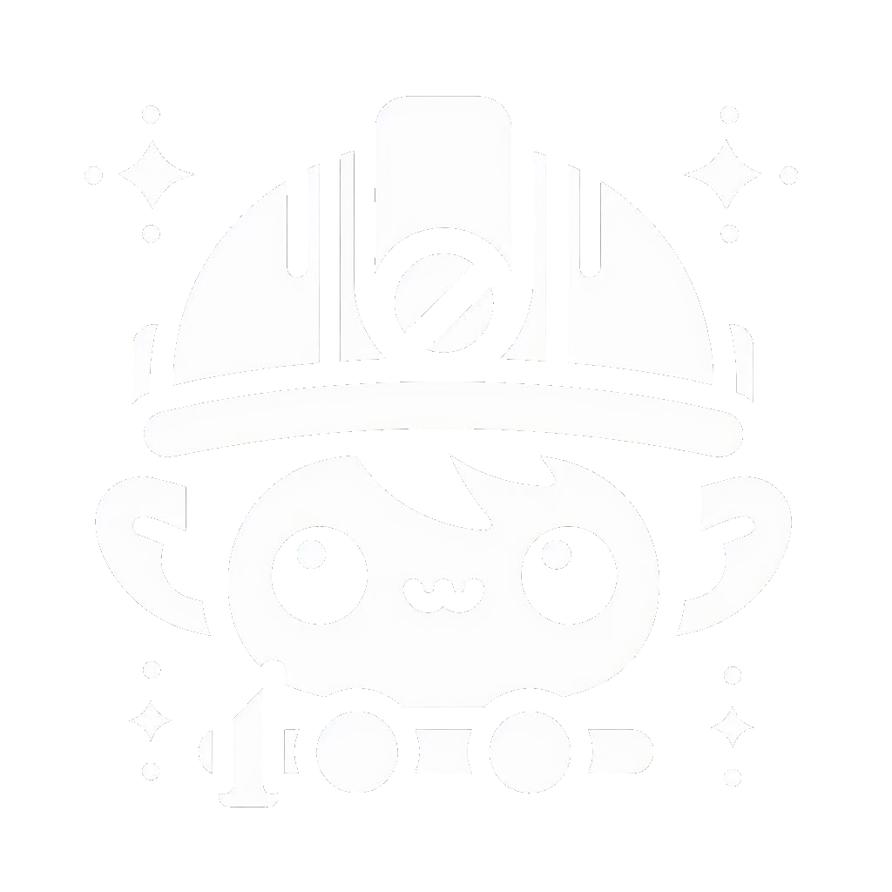

<p align="center" width="100%">
    
</p>

<p align="center">
    
    
</p>

<p align="center">
    😈 ImpAI is an advanced role play app using large language and diffusion models.
</p>

<p align="center" width="100%">
    
</p>

#  Start here

> ℹ️ You need [NodeJS](https://nodejs.org) and [Python3.11](https://www.python.org/)

Run the following commands for download models and build the project:

```bash
bash start.sh
```

Open your browser at http://localhost:4242

#  Config

### You can change **root prompt**, **prompt** and **size of images** generated at the top right of the screen !

> ℹ️ `root prompt` is the first template used by **ImpAI** and `prompt` is the template used for every next messages


> ℹ️ You can modify the large language model in the file `start.sh`
(`MODEL` == `file name` and `MODEL_HF` == `repository + quantization`):

```bash
# English Mistral 7b Q4_K_M by default
MODEL=mistral-7b-instruct-v0.1.Q4_K_M.gguf
MODEL_HF=TheBloke/Mistral-7B-Instruct-v0.1-GGUF:q4_k_m

# French Mistral 7b Q4_K_M for example
# MODEL=vigostral-7b-chat.Q4_K_M.gguf
# MODEL_HF=TheBloke/Vigostral-7B-Chat-GGUF:q4_k_m
```

> ℹ️ You can modify the stable diffusion model in the file `start.sh`

```bash
# Stable Diffusion Model
SD_MODEL=stabilityai/sdxl-turbo
```

### If you want, you can add non player characters to your story !


#  Todo List

- [x] Chat

- [x] Image

- [x] Settings

- [x] NPC creation
    - [ ] Automatic npc creation

- [ ] Save system

- [ ] Suggested action

- [ ] Multiple users

- [ ] RPG mode with dices

- [ ] Video/GIF output

- [ ] Audio input
