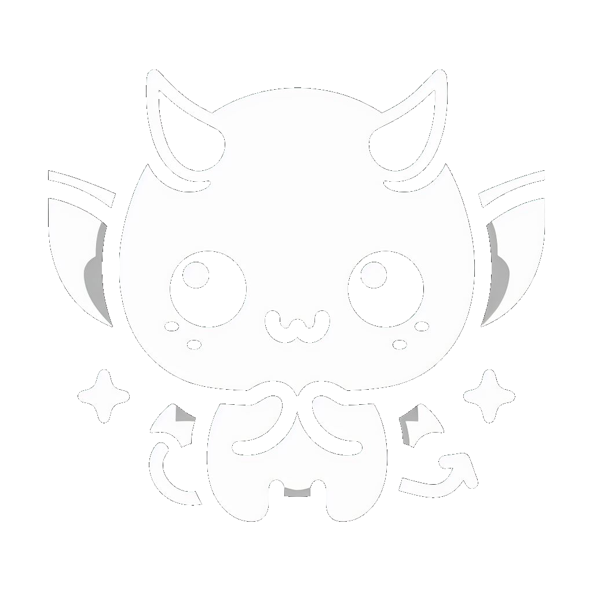

<p align="center" width="100%">
    
</p>

<p align="center">
    
    
</p>

<p align="center">
    😈 ImpAI is an advanced role play app using large language and diffusion models.
</p>

<p align="center" width="100%">
    
</p>

## 🎬 Start here

> ℹ️ You need [NodeJS](https://nodejs.org) and [Python3.10](https://www.python.org/)

Run the following commands for download models and build the project:

```bash
bash start.sh
```

Open your browser at http://localhost:4242

## 🛠️ Config

You can change **root prompt**, **prompt** and **size of images** generated at the top right of the screen !

> ℹ️ `root prompt` is the first template used by **ImpAI** and `prompt` is the template used for every next messages


> ℹ️ You can modify the model in the file `start.sh`
(`MODEL` == `file name` and `MODEL_HF` == `repository + quantization`):

```bash
# English Mistral 7b Q4_K_M by default
MODEL=mistral-7b-instruct-v0.1.Q4_K_M.gguf
MODEL_HF=TheBloke/Mistral-7B-Instruct-v0.1-GGUF:q4_k_m

# French Mistral 7b Q4_K_M for example
# MODEL=vigostral-7b-chat.Q4_K_M.gguf
# MODEL_HF=TheBloke/Vigostral-7B-Chat-GGUF:q4_k_m
```

## 📋 Todo List

- [x] Chat with LLM as Role Play Game Master

- [x] See image illustrating the RP scene generated by diffusion model

- [ ] Settings menu:
    - [x] Prompt
    - [x] Image size
    - [ ] LLM Model
    - [ ] SD Model

- [ ] Save system

- [ ] Suggested action

- [ ] Character creator

- [ ] Multiple users

- [ ] RPG mode with dices

- [ ] Audio input

