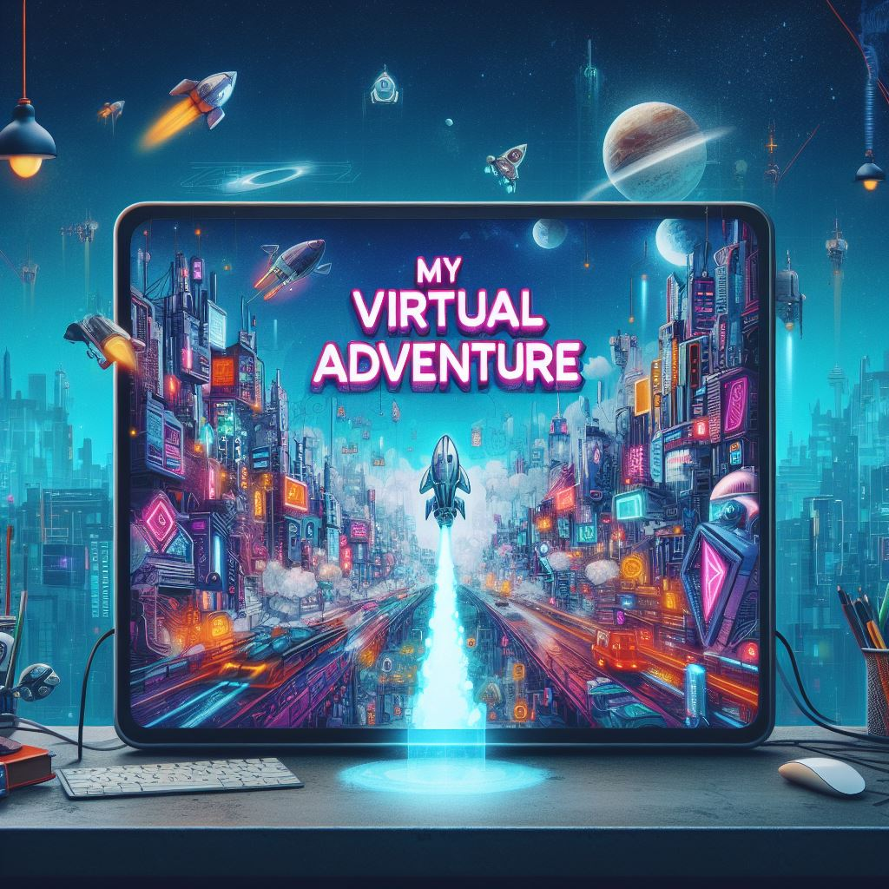

<p align="center" width="100%">
    
</p>

<p align="center">
    
    
</p>

<p align="center">
    🚀 My Virtual Adventure is an advanced role play with large language and diffusion models 🧝🏻‍♂️
</p>

<p align="center" width="100%">
    
</p>

## Start here

> ℹ️ You need [NodeJS](https://nodejs.org) and [Python3.10](https://www.python.org/)

Run the following commands for download models and build the project:

```bash
chmod +x start.sh
./start.sh
```
